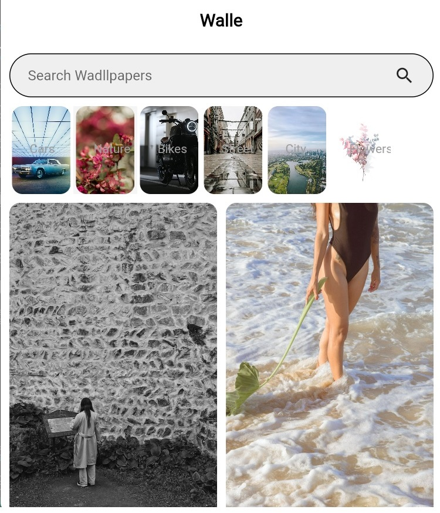
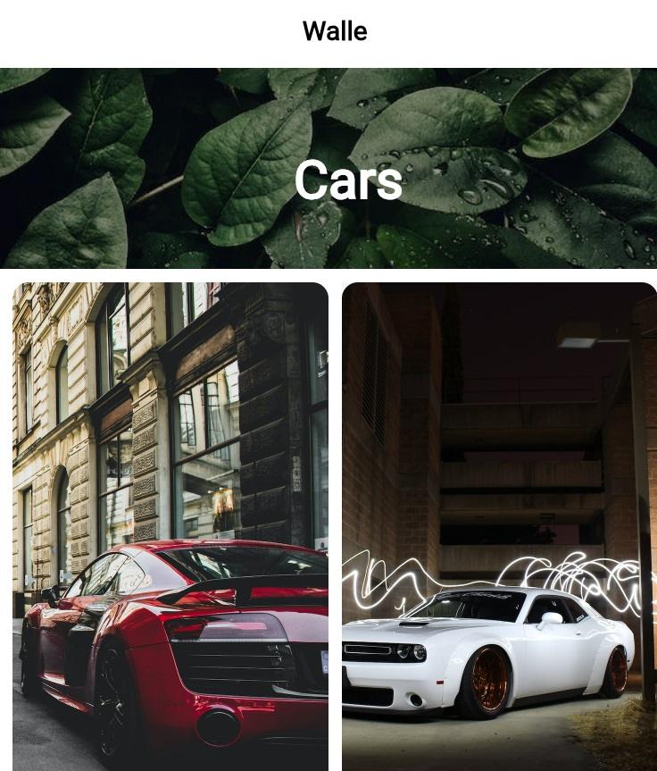
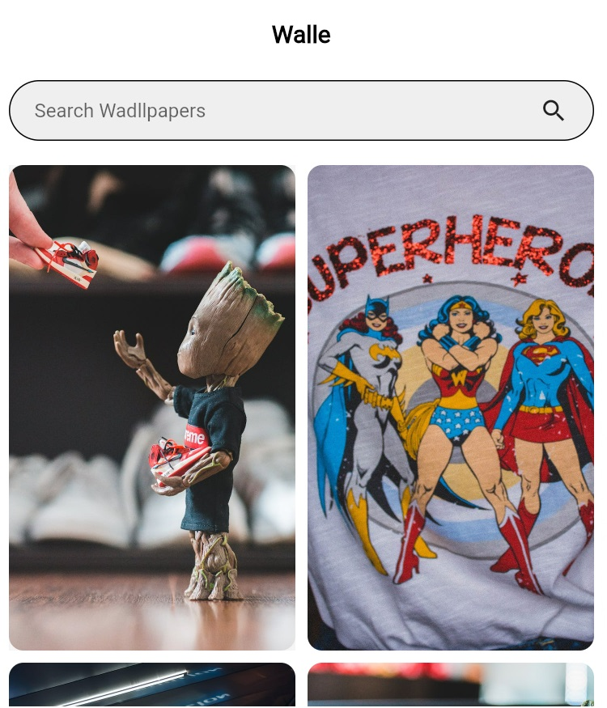

# Wallpaper App Walle
The Flutter Wallpaper App is a mobile application that allows users to customize their device's home screen and lock screen with unique and visually appealing wallpapers. The app features various high-quality images, including nature scenes, cityscapes, abstract designs, and more. Users can browse through the collection and select the wallpapers that best suit their style. The app also offers a range of customization options, such as the ability to crop, resize, and rotate images, as well as adjust their brightness, contrast, and saturation. Additionally, the app includes a live wallpaper feature, which allows users to set animated wallpapers on their devices. The Flutter Wallpaper App is easy to use and navigate, making it an excellent choice for users looking to personalize their device's home screen and lock screen.

## API
- [API : Pexels.com](https://www.pexels.com)

## Screenshots

